## Creación del Bucket S3

Primer, antes de crear el cluster de EMR lo que debemos hacer es crear un Bucket S3 donde vamos a almacenar todos los archivos necesarios, para esto nos dirigimos al servicio de AWS llamado `S3`

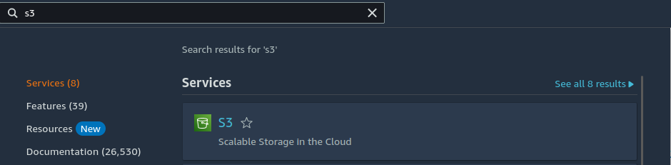

Luego, estando allí damos clic al botón naranja que dice "Create bucket"

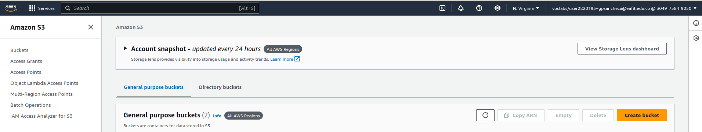

Luego, lo que haremos es configurar el bucket de la siguiente manera:

1. Le damos un nombre al bucket (en mi caso se llamará bucket-lab0)

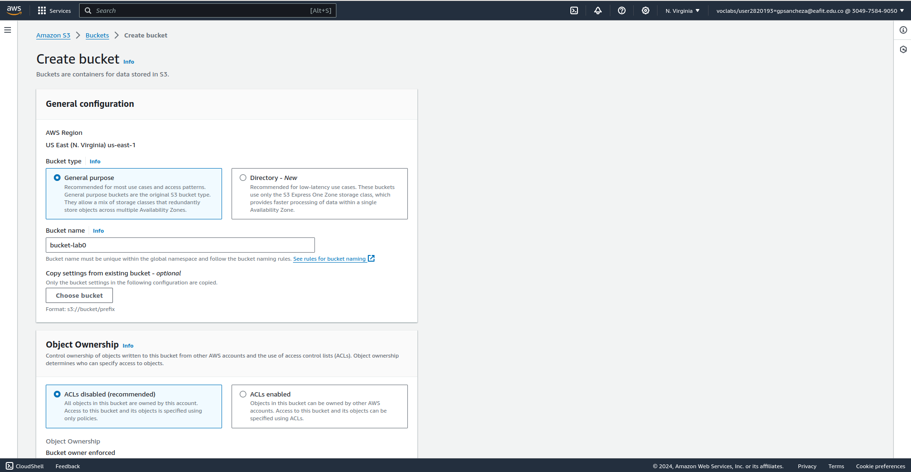

2. Cambiamos la accesibilidad del bucket

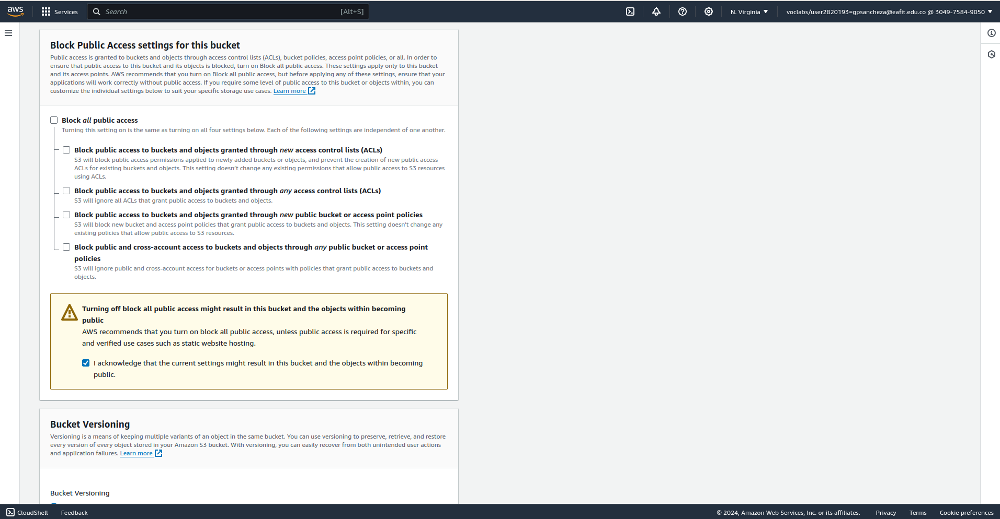

Es muy importante que desmarquemos la casilla que bloquea el acceso público al bucket y marquemos la casilla que nos dice que entendemos que el bucket podrá ser accedido por cualquier persona.

Esto lo hacemos ya que nos encontramos en un ambiente experimental donde no contamos con ningunos datos sensibles. OJO, EN UN AMBIENTE REAL, DE PRODUCCIÓN ESTARÍA MUY MAL REALIZAR ESTO.

Las demás configuraciones del bucket si quedan por defecto como vienen.

Después de tener todas las configuraciones hechas le damos clic al botón naranja que dice "Create bucket"

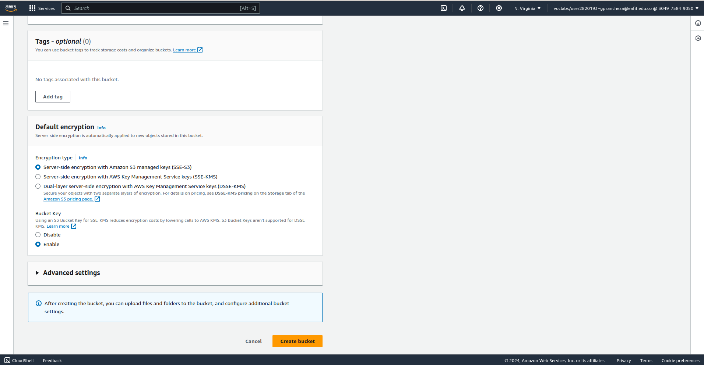

Ya podríamos ver entonces en el listado de buckets, el que acabamos de crear (bucket-lab0).

## Creación del cluster EMR

Primero debemos ingresar a AWS al servicio de EMR

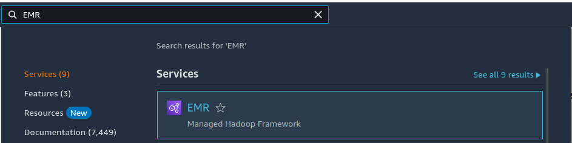

Luego debemos darle al botón que dice "Create cluster" que está en naranja

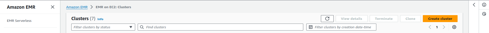

Allí dentro comenzaremos a cambiar a modificar ciertas configuraciones que nos permitirán tener un cluster con las características deseables:

1. Le damos un nombre al cluster (en mi caso se llamará cluster-lab0) y escogemos la versión 6.14.0

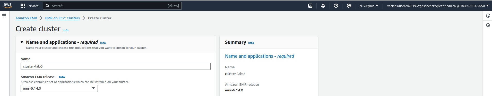

2. Marcamos las siguientes aplicaciones quie serán usadas en el cluster y marcamos las dos casillas que corresponden a los catálogos

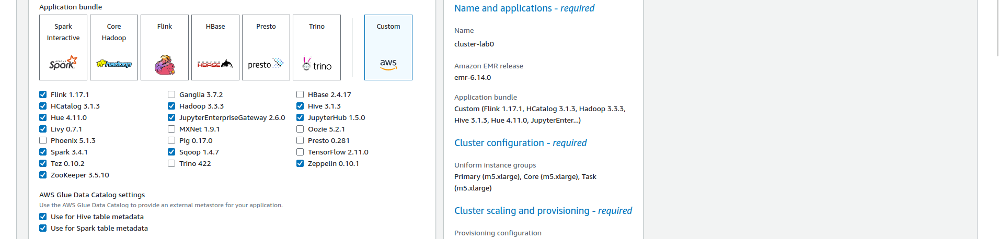

3. Configurar software settings, es decir, dar clic donde dice "Software settings" y agregar la siguiente configuración:

```bash
[
  {
    "Classification": "jupyter-s3-conf",
    "Properties": {
      "s3.persistence.bucket": "bucket-lab0",
      "s3.persistence.enabled": "true"
    }
  }
]
```

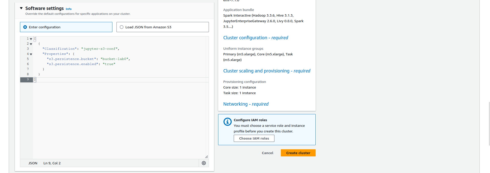

4. Escoger la llave para conectarse por ssh a las instancias del cluster

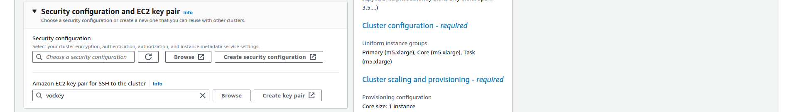

5. Escoger los siguientes roles como se muestran en la siguiente foto

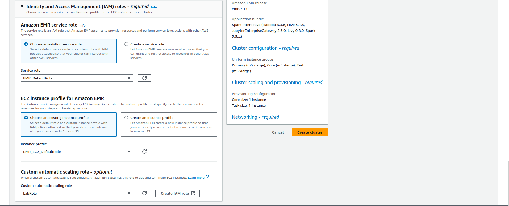

Después de tener todas las configuraciones hechas le damos clic al botón naranja que dice "Create cluster" y deberíamos esperar hasta que quede creado el cluster (esto puede tardar alrededor de 20 mins) y debería verse así:

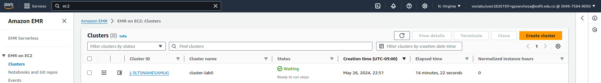

Después de tener el cluster debemos abrir todos sus puertos TCP, para esto nos dirigimos a la pestaña que se llama "Block public access" y marcammos la casilla que dice "Turn off" para luego darle a "Save". Debería verse así

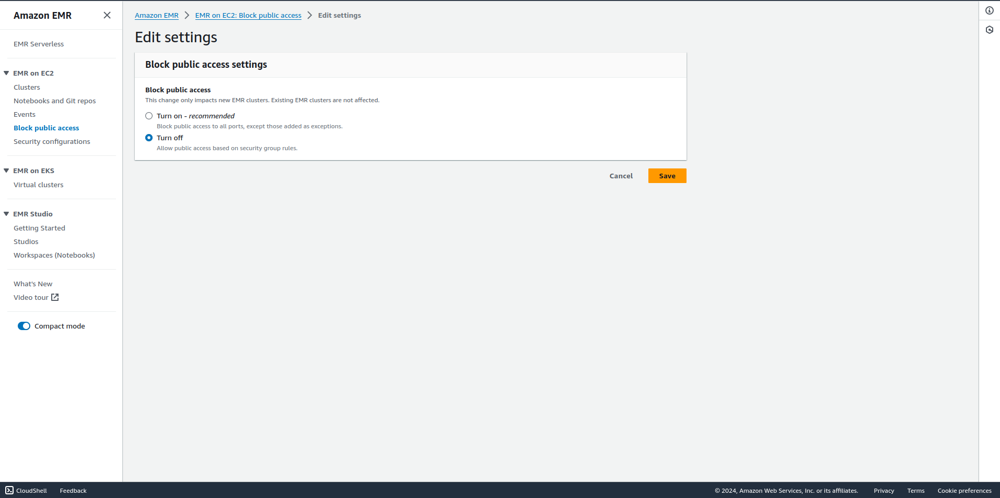

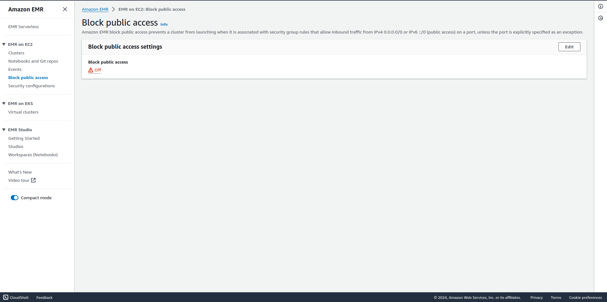

Después lo que debemos hacer es habilitar ciertos puertos del grupo de seguridad que tiene el nodo master de nuestro clúster. Para saber cual es este nodo primero nos dirigimos a los detalles del cluster que hemos creado (cluster-lab0)

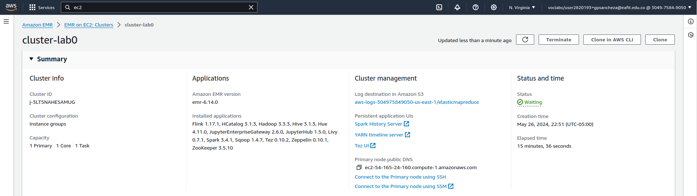

Y allí veríamos la dirección o dns del nodo primario, es decir, master.

Luego lo que deberíamos hacer es irnos al servicio ec2 de AWS

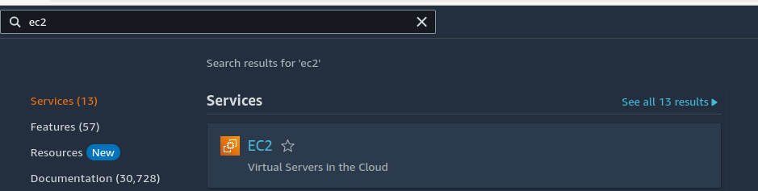

Y a las instancias de este servicio

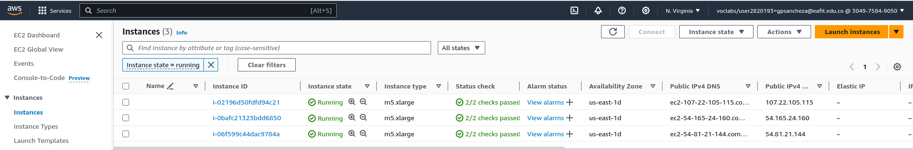

Aquí buscamos la instancia que tiene el mimso dns que el observado en los detalles del cluster  (es decir, buscamos el nodo master, que en nuestro caso es el segundo). Damos clic sobre la casilla a su izquierad y nos dirigmos al apartado de seguridad

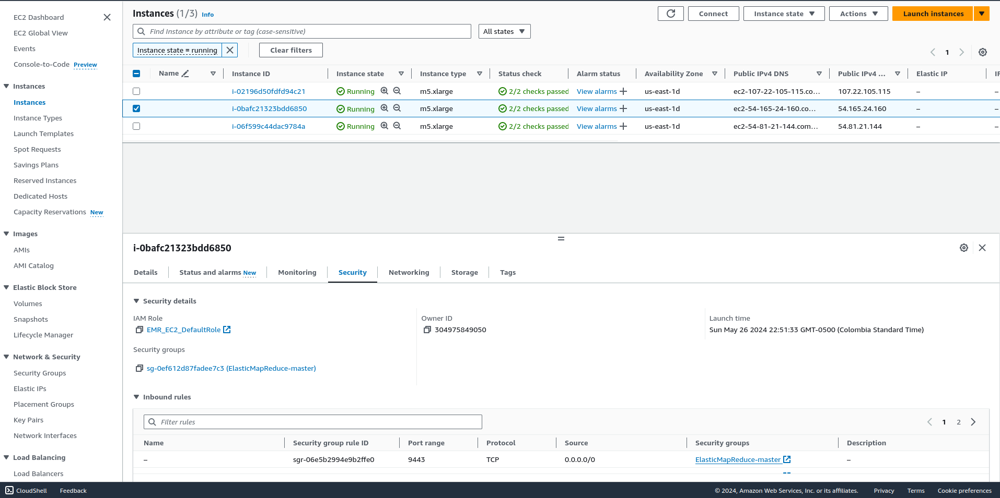

Allí, damos clic sobre el grupo de seguridad de esta instancia y verpíamos la interfaz de este grupo de segudirad

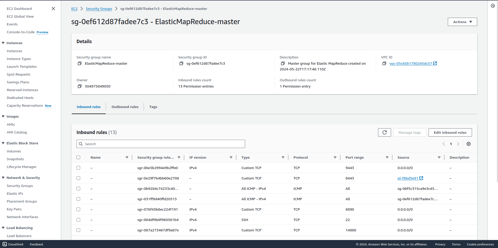

Así pues, lo que debemos hacer es editar las configuraciones de este grupo para permitir la entrada de cualquier dispositivo a los siguientes puertos:

- 22
- 14000
- 9870
- 8888
- 9443
- 8890

Después de esto ya habríamos configurado todo lo necesario para que nuestro sistema funcione

## Clonar el cluster

Cada cierto tiempo nuestro cluster va a morir ya que este es un servicio temporal (debido a que esto es experimental), así pues para volver a subir nuestro sistema no debemos realizar todo de neuvo sino que debemos marcar la casilla que se encuentra a la izquierda del cluster que ya ha sido parado y darle clic al botón que dice "Clone"

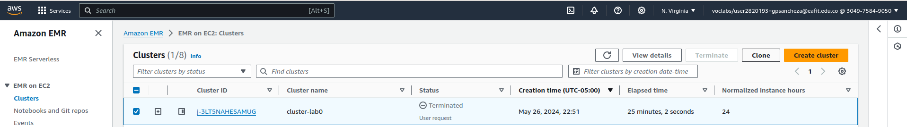

Luego, igoramos todas las configuraciones ya que estas ya quedan configuradas con las del cluster anterior y le damos clic al botón naranja que dice "Clone cluster"

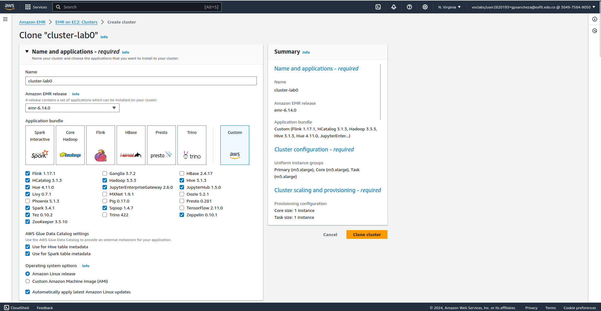

Después deberíamos esperar nuevamente alrededor de 20 mins hasta que el cluster esté corriendo.

### Parche de hue

Si queremos acceder y manipular los archivos del hdfs desde la interfaz de hue, debemos ingresar al nodo master del cluster EMR usando el usuario ec2-user

`sudo ssh -i ~/vockey.pem ec2-user@ec2-54-211-75-220.compute-1.amazonaws.com`

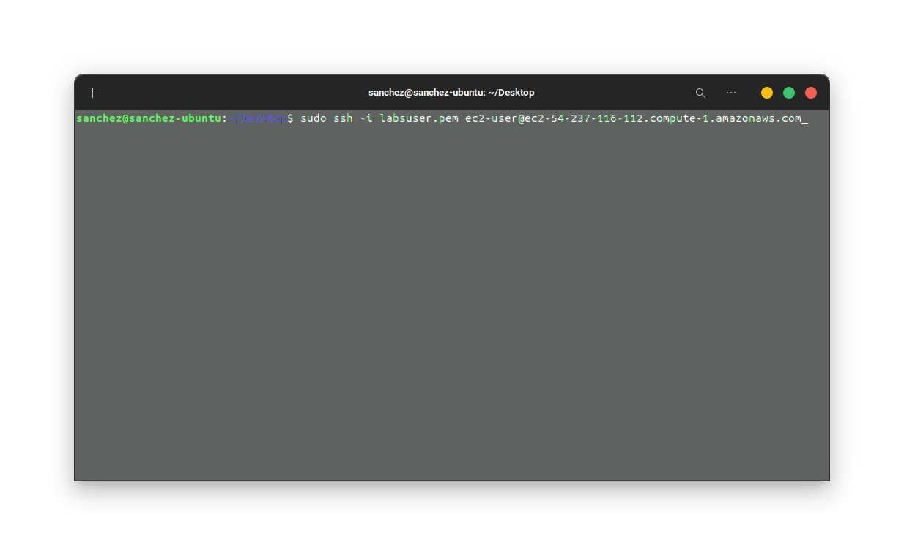

Luego, debemos editar el archivo de configuración de hue

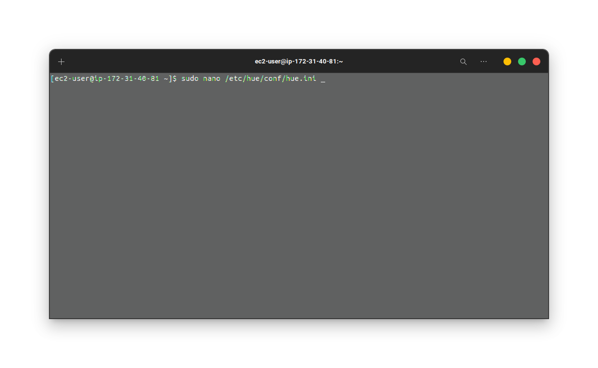

Debemos modificar la linea que dice 'webhdfs_url', cambiando el número de puerto de 14000 a 9870, así:

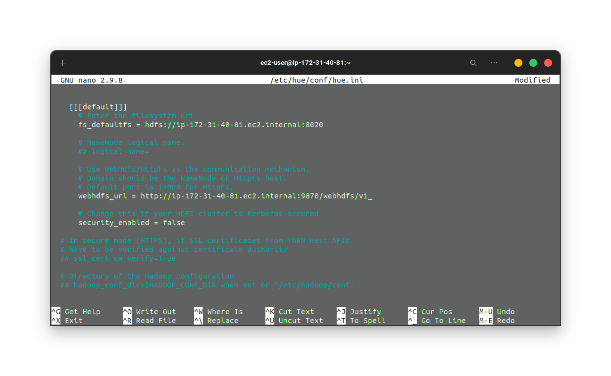

Por último debemos reiniciar el servicio hue para que este tome en cuenta los cambios realizados

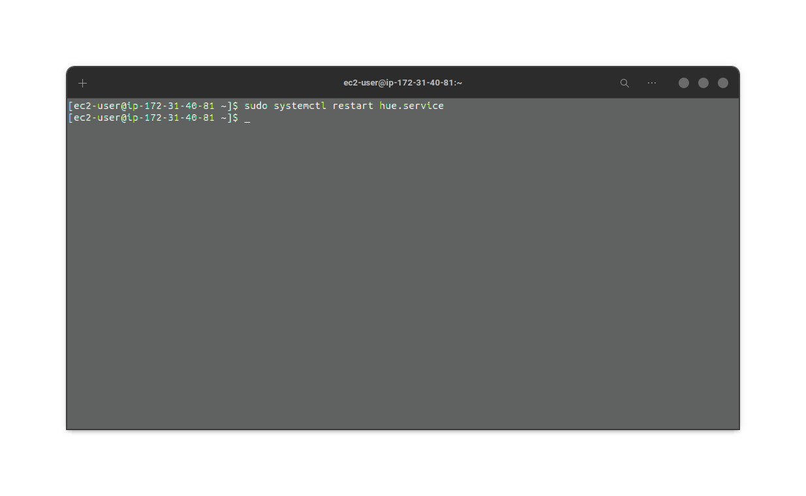

Listo, ya deberíamos tener todas las configuraciones realizadasy y podríamos acceder al apartado de archivos de hue donde podríamos visualizar todos los archivos que han sido subidos al hdfs.

IMPORTANTE: Recordar que cada que debido a que este parche se está haciendo sobre la intancia de un clúster, y estos son temporales, cada que un cluster muere y se crea uno nuevo, se debería realizar este proceso de nuevo, esto para que la nuevo isntancia master del nuevo cluster tenga el parche de hue.