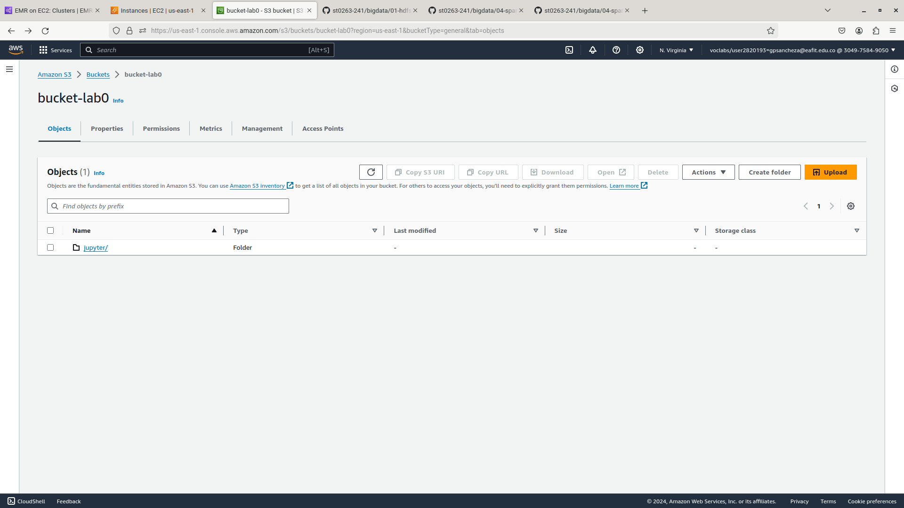
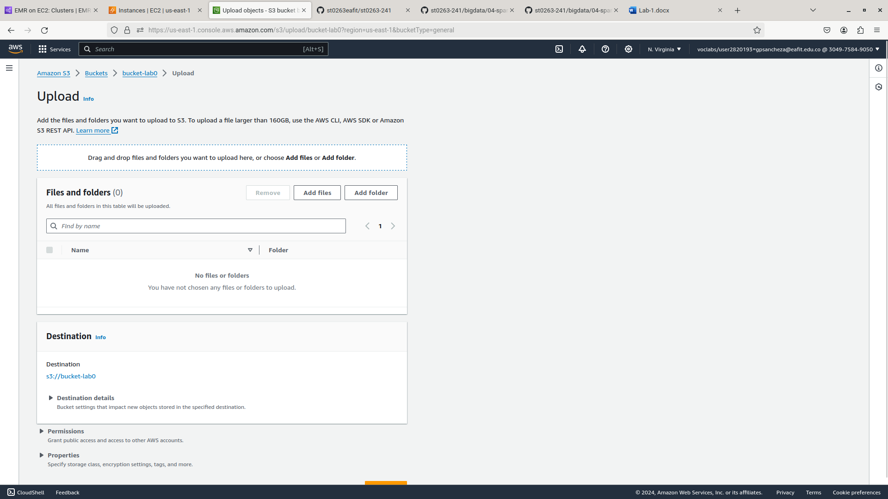
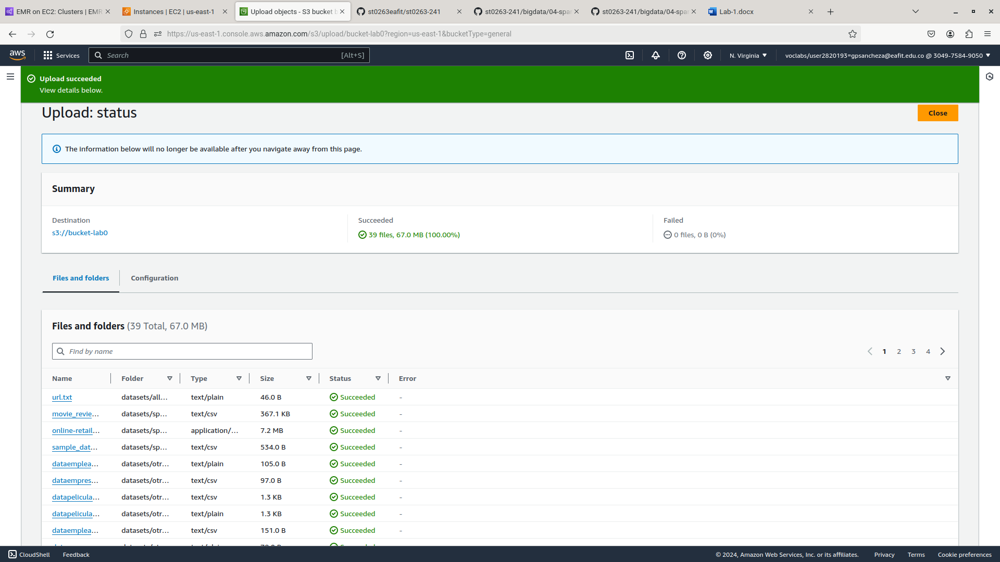
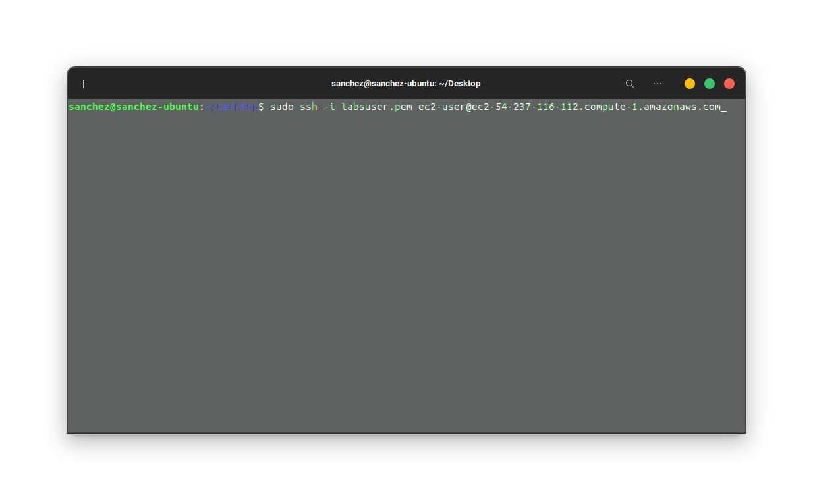
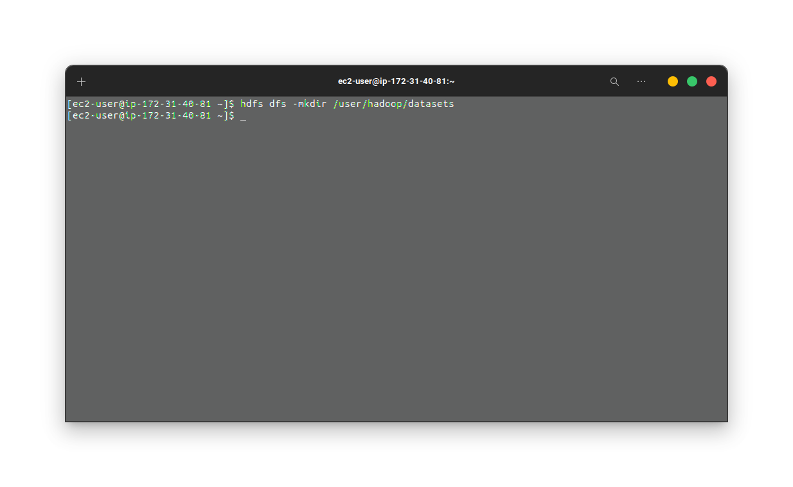
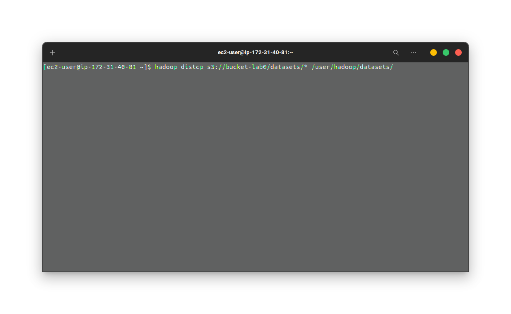
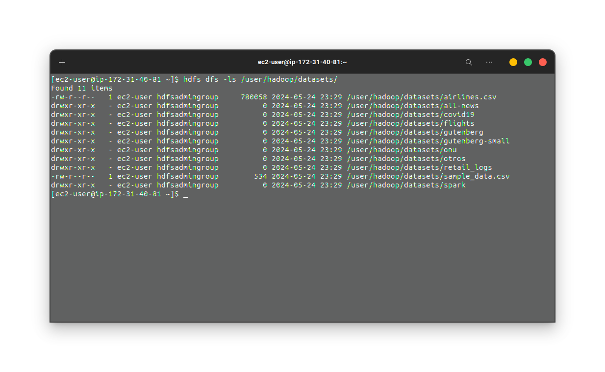
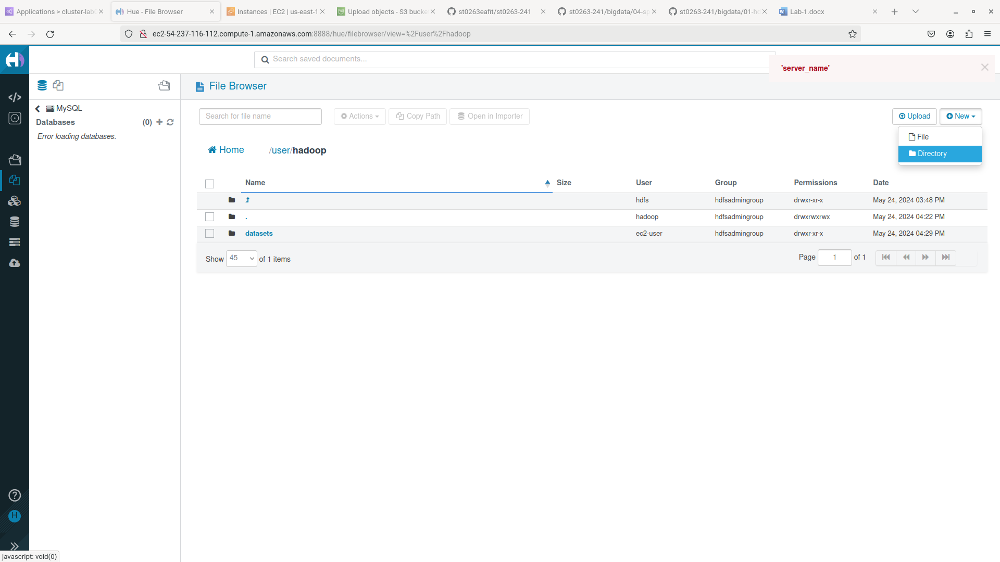
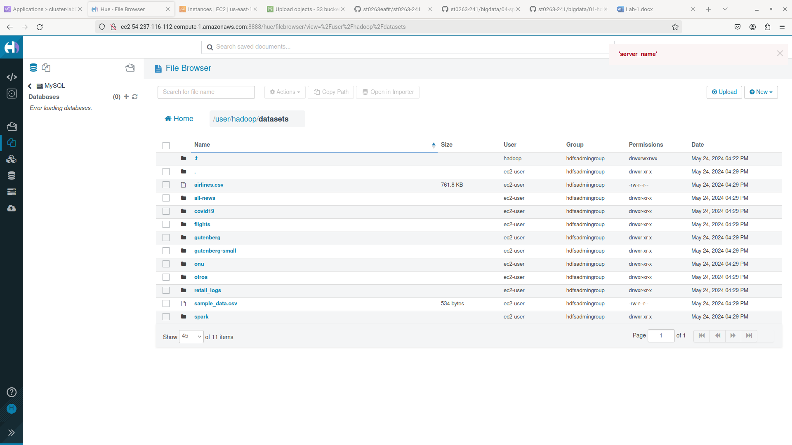

## Subida de archivos a hadoop desde la consola

Clonar el repositorio en tu máquina local haciendo `git clone https://github.com/st0263eafit/st0263-241.git`

Ingresar al bucket S3 que fue creado para el labortaorio 0 y dar clic sobre el botón ‘Upload’ para subir los datasets que fueron descargados desde el github de la materia: 

Luego, dar clic sobre ‘Add folder’, buscar los datasets que fueron descargados al clonar el repositorio en la máquina local, y subir la carpeta:

Debería verse así:

Ingresar al nodo master del cluster EMR usando el usuario ec2-user

`sudo ssh -i ~/vockey.pem ec2-user@ec2-54-211-75-220.compute-1.amazonaws.com`

Luego podemos revisar los archivos que tenemos en el sistema actualmente haciendo: `hdfs dfs -ls /user/hadoop/`, y deberíamos que no hay nada por el momento (a menos que ya haya subido algo anteriormente).

Después vamos crear una carpeta para almacenar los archivos que vayamos a subir (en este caso los datasets)

Ahora, agregaremos los archivos a esta nueva carpeta que hemos creado. Hay varias maneras de hacer esto:

1. Clonar en la máquina master del EMR el repositorio para desde allí obtener los archivos y copiarlos en la nueva carpeta.

2. Copiar los archivos desde un S3 Bucket hacia la nueva carpeta

En este paso a paso, se realizó con el numeral número dos, pero no estaba demás mencionar la otra manera.

Así pues, agreagamos los archivos del S3 Bucket al hdfs haciendo `hadoop distcp s3://bucket-lab0/datasets/* /user/hadoop/datasets/`

Ahora, al hacer ‘ls’ de los archivos que tenemos dentro de la carpeta creada hace un momento (/user/hadoop/datasets/) deberíamos obtener todos los archivos del dataset del github del curso, veamos:

NOTA: En caso de haber realizado la subida de archivos por consola (es decir, siguiendo los pasos anteriores) y querer ver los archivos subidos usando hue, deberá entonces seguir los pasos que se encuentran más abajo.

## Subida de archivos a hadoop desde la interfaz de hue

Teniendo en cuenta que ya se realizó el parche de hue para que sean visibles los archivos desde esta interfaz (es decir, teniendo en cuenta que se siguieron los pasos para la creación y configuración del cluster del laboratorio 0)

Para acceder y manipular los archivos del hdfs solo bastaría con ingresar a hue al apartado de 'files', para desde allí crear una carpeta llamada 'datasets'

Y luego, entrar a esta carpeta para subir todos los archivos de los datasets, quedando de esta manera

