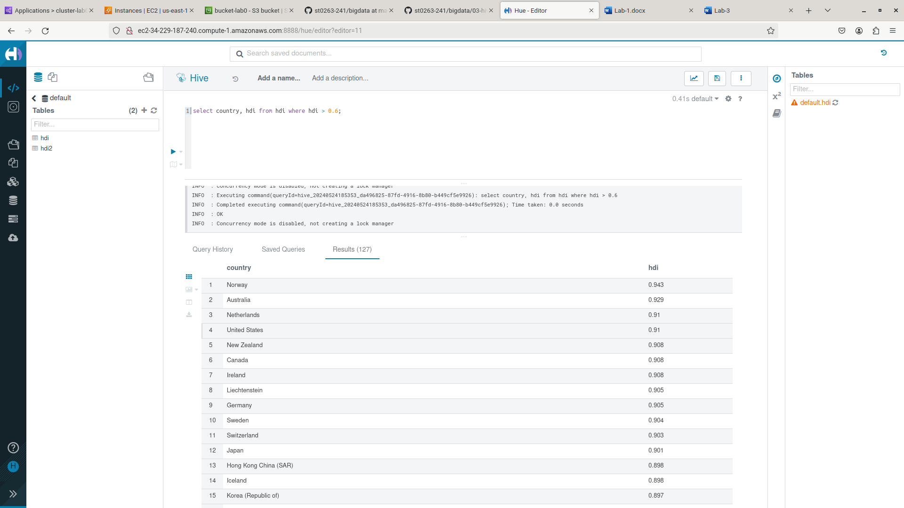

## Usando el hdfs

Primero debemos ingresar a hue en el servicio de hive, y cerciorarnos de que la sesión que se esté usando sea 'hive'


Estando aquí dentro ejecutamos el siguiente código SQL para crear la tabla 'hdi'

```bash
CREATE TABLE HDI (id INT, country STRING, hdi FLOAT, lifeex INT, mysch INT, eysch INT, gni INT)  
ROW FORMAT DELIMITED FIELDS TERMINATED BY ',' 
STORED AS TEXTFILE 
```

Deberíamos obtener un resultado como el siguiente, donde al lado izquierdo podemos ver la nueva tabla creada:


Si hacemos select de esta tabla que se acabó de crear vemos que no hay ningún resultado: 


Así pues, para poblar nuestra tabla nos dirigimos a la pestaña ‘files’ y a la carpeta ‘/user/hive/warehouse/’, allí veremos que tenemos la carpeta hdi creada:


Dentro de esta carpeta debemos subir el archivo ‘hdi-data2.csv’ que se encuentra en la carpeta ‘bigdata/datasets/onu/hdi’ del repositorio de github de la materia


Ahora, si hacemos un select de la tabla ‘hdi’ obtendremos todos los registros de la tabla (los cuales fueron rellenados usando el csv que acabamos de subir) 


Probemos ahora ejecutando unas consultas y cálculos para ver que todo está funcionando correctamente:




Ahora, creamos una tabla llamada ‘expo’ de la siguiente manera:

```bash
CREATE EXTERNAL TABLE EXPO (country STRING, expct FLOAT)  
ROW FORMAT DELIMITED FIELDS TERMINATED BY ','  
STORED AS TEXTFILE  
LOCATION 's3://bucket-lab0/datasets/onu/export/' 
```

Deberíamos obtener un resultado como el siguiente, donde al lado izquierdo podemos ver la nueva tabla creada


Después, haremos la ejecutaremos la siguiente consulta (la cuál es un join entre la tabla 'hdi' y la nueva tabla 'expo')


Ahora ejecutamos el siguiente código SQL para crear la tabla 'docs'

```bash
CREATE EXTERNAL TABLE docs (line STRING) 
STORED AS TEXTFILE 
LOCATION 'user/hadoop/datasets/gutenberg-small/';
```
Deberíamos obtener un resultado como el siguiente, donde al lado izquierdo podemos ver la nueva tabla creada


Luego ejecutamos la siguiente consulta para obtener el conteo de palabras ordenado alfabéticamente


Por último ejecutamos la siguiente consulta para obtener el conteo de palabras ordenado por frecuencia


## Usando el S3 Bucket

Realizando los siguientes passo logramos lo mismo que lograríamos haciendo los anteiores, lo único que cambia es que los datos ahora no serán obtenidos usando el hdfs, sino directamente desde el Bucket de S3 que fue creado en pasados laboratorios y el cual tiene los archivos de los datasets (si no los tiene, debe subirlos allí).

Primero debemos ingresar a hue en el servicio de hive, y cerciorarnos de que la sesión que se esté usando sea 'hive'


Estando aquí dentro ejecutamos el siguiente código SQL para crear la tabla 'hdi2'

```bash
CREATE EXTERNAL TABLE HDI2 (id INT, country STRING, hdi FLOAT, lifeex INT, mysch INT, eysch INT, gni INT) 
ROW FORMAT DELIMITED FIELDS TERMINATED BY ',' 
STORED AS TEXTFILE 
LOCATION 's3://bucket-lab0/datasets/onu/hdi/'
```

Deberíamos obtener un resultado como el siguiente, donde al lado izquierdo podemos ver la nueva tabla creada:


Ahora, si hacemos un select de la tabla ‘hdi2’ obtendremos todos los registros de la tabla (los cuales fueron insertados usando el csv del archivo almacenado en un Bukcet S3 en la ubicación indicada en el SQL)


Probemos ahora ejecutando unas consultas y cálculos para ver que todo está funcionando correctamente:


Ahora, creamos una tabla llamada ‘expo’ de la siguiente manera:

```bash
CREATE EXTERNAL TABLE EXPO (country STRING, expct FLOAT)  
ROW FORMAT DELIMITED FIELDS TERMINATED BY ','  
STORED AS TEXTFILE  
LOCATION 's3://bucket-lab0/datasets/onu/export/' 
```

Deberíamos obtener un resultado como el siguiente, donde al lado izquierdo podemos ver la nueva tabla creada


Después, haremos la ejecutaremos la siguiente consulta (la cuál es un join entre la tabla 'hdi2' y la nueva tabla 'expo')


Ahora ejecutamos el siguiente código SQL para crear la tabla 'docs2' (la cual va a obtener los datos desde el Bucket S3)

```bash
CREATE EXTERNAL TABLE docs (line STRING) 
STORED AS TEXTFILE 
LOCATION 's3://bucket-lab0/datasets/gutenberg-small/';
```

Deberíamos obtener un resultado como el siguiente, donde al lado izquierdo podemos ver la nueva tabla creada


Luego ejecutamos la siguiente consulta para obtener el conteo de palabras ordenado alfabéticamente


Por último ejecutamos la siguiente consulta para obtener el conteo de palabras ordenado por frecuencia


## Reto propuesto en el laboratorio

Creamos una tabla que va a obtener y subir los datos usando hadoop en la direccipón `/user/hadoop/datasets/reto`


Luego, ejecutamos el siguiente código SQL el cual insertará el resultado de una consulta (en este caso el de la frecuencia de cada palabra ordenada de mayor a menor) en la tabla que acabamos de crear

```bash
INSERT OVERWRITE TABLE wordcount
SELECT word, count(1) AS count
FROM (
    SELECT explode(split(line, ' ')) AS word
    FROM docs
)
GROUP BY word
ORDER BY count DESC;
```


Ahora, si hacemos un select para observar los registros que tenemos en la tabla 'wordcount' veremos cada palabra con su frecuencia respectiva y además ordenado de mayor a menor:


También podremos ver como en la carpeta `/user/hadoop/datasets/` se ha creado la carpeta `reto` donde si entramos vamos a encontrar los datos de la tabla:


